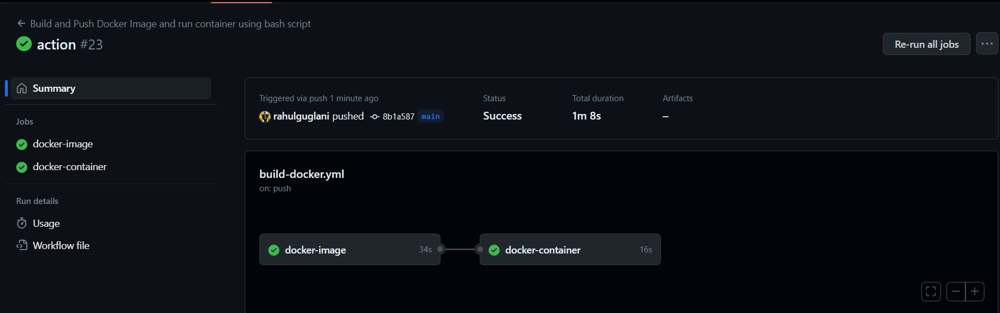
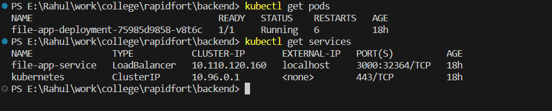

# File Information App

This Project is for Rapidfort Campus Recruietment Drive! This project involves creating a REST API-based web server that allows users to upload files and retrieves information about the uploaded files. Also in this project we have configured Docker image and automated docker image build and push using Github actions and also made an bash script to run a docker container which runs the docker image and also automated that using github action.

## Project Links

- [Backend Repository](https://github.com/rahulguglani/rf-backend)
- [Frontend Repository](https://github.com/rahulguglani/rf-frontend)
- [Deployed Backend](https://rf-backend-production.up.railway.app/)
- [Deployed Frontend](https://file-info-rapidfort.netlify.app/)

## Project Overview
Main objective of this project is to retrive the file information that we upload on the webserver.

## Key Features

- Upload files via frontend.
- Obtain information about the file.
- containerized application using docker.
- Kubernetes-compatible for easy deployment and management.
- configured app automation using github actions

## UI Overview

I have made the frontend of the app using html, css and javascript, when we click on upload a file button an window appear for selecting a file and after selection name of the file is shown and a button for upload is provided , after uploading the details of the file are shown.

## Implementation Steps

### 1. Backend Development

- I have made Backend using node js , main api `/upload` post api is stored in `app.js` which stores the uploaded file using multer library.
- after correct file , information of file is retrived such as file name , size and file type and is send as response.
- server can be run through `node app.js`

### 2. Docker Containerization

- firstly i have created `Dockerfile` that defines how the backend application should be containerized.
- then i have configured building and pushing of docker image in docker-build.yml which has a job to build and push docker image.
- also `docker-build.yml` file also have a job that run bash file to run the container.
- firsty build and push job is completed then run container job is completed.

### 3. Kubernetes Deployment

- for Kubernetes we have made two files `deployment.yaml` and `service.yaml` in a folder name Kubernetes
- and then applied these confriguation into action using these command, it runs in localhost with the help of docker desktop feature:
  - `kubectl apply -f ./kubernetes/deployment.yaml`
  - `kubectl apply -f ./kubernetes/service.yaml`

### 4. Backend Deployment

- I have deployed the backend on `railway.app`` to make the api endpoints publically avilaible.

### 5. Frontend Development

- In frontend development i have created three files namely `index.html`, `styles.css` and `scripts.js` for a simple ui for the application.
- I have hosted the frontend on Netlify.