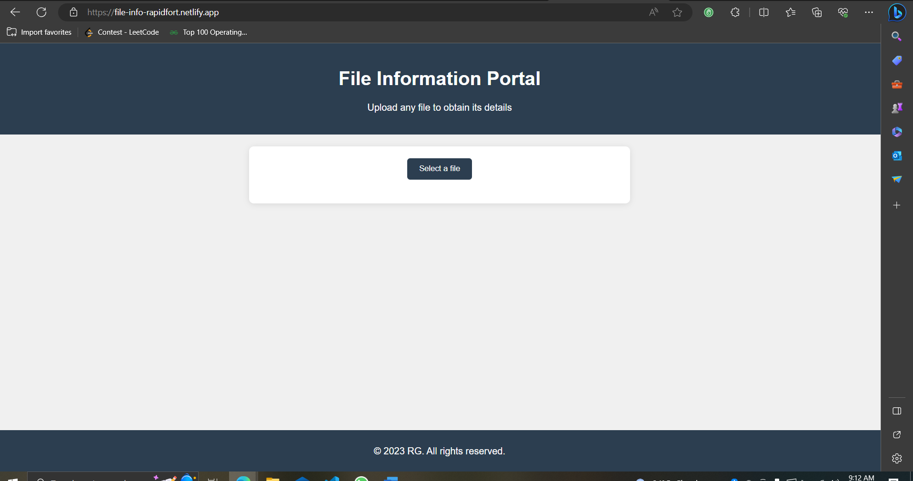
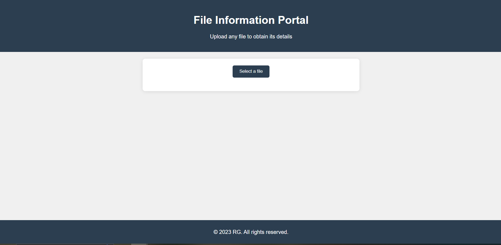
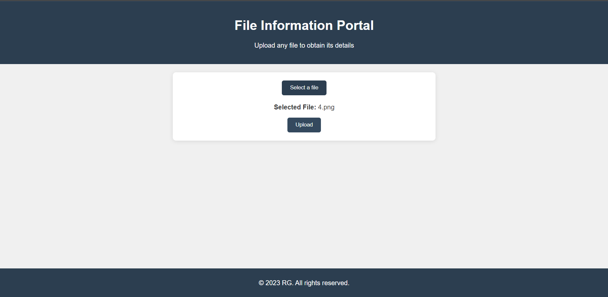
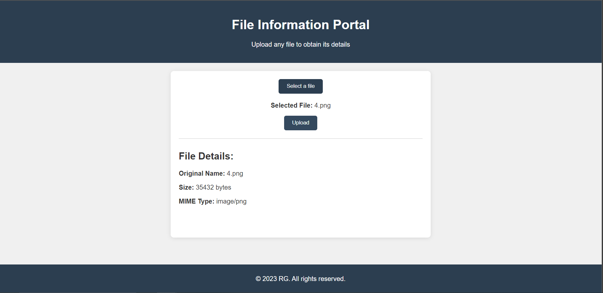
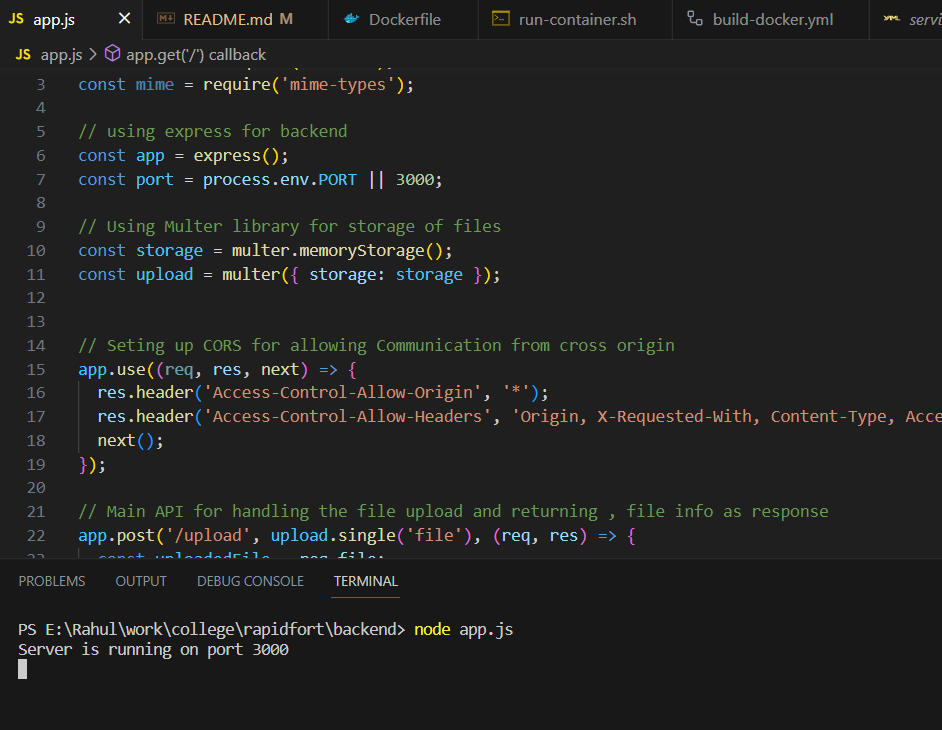
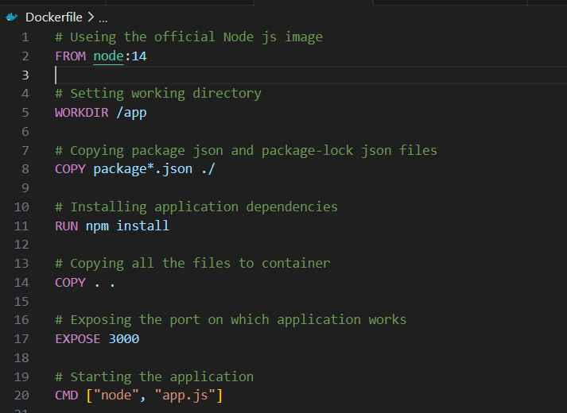
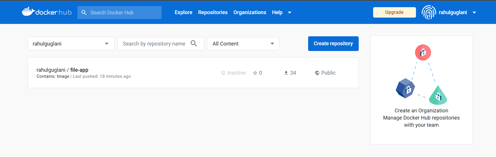
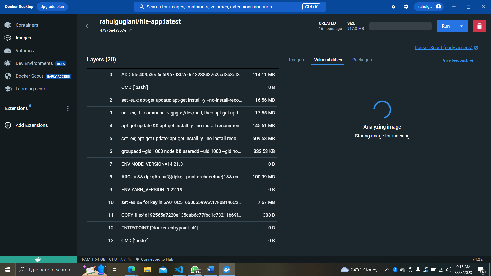
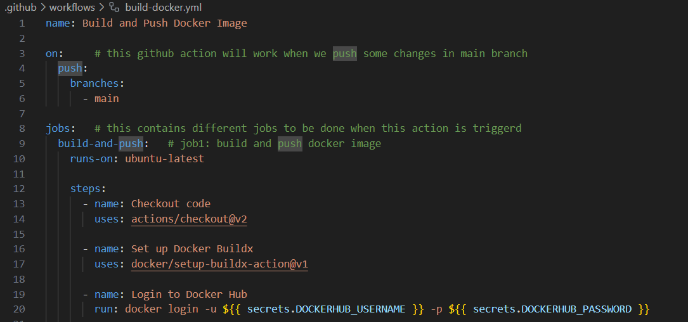
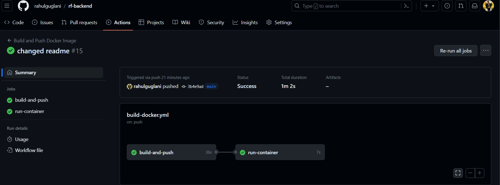

# File Information App

Welcome to the RapidFort Campus Recruitment Drive Offline Project! This project involves creating a REST API-based web server that allows users to upload files and retrieves information about the uploaded files. The project also includes additional features such as a simple user interface, Docker containerization, and Kubernetes deployment.

## Project Links

- [Project Repository](https://github.com/rahulguglani/rf-backend)
- [Frontend Repository](https://github.com/rahulguglani/rf-frontend)
- [Deployed Backend](https://rf-backend-production.up.railway.app/)
- [Deployed Frontend](https://file-info-rapidfort.netlify.app/)

## Project Overview
This is an offline project mainly focused on creating a REST API-based web server that handles file uploads and provides us the information about the uploaded files. This documentation will guide you through the project’s objectives and implementation.

### Backend Development

1. **Express Server Setup:** The backend is built using Node.js and Express.js, providing a robust foundation for handling HTTP requests and file uploads.
2. **File Upload Endpoint:** The `/upload` endpoint allows users to upload files, which are then processed to provide detailed information.
3. **Welcome Message Endpoint:** The root endpoint `/` greets users with a welcome message to confirm the API's availability.

### Docker Containerization

1. **Dockerfile Definition:** The project provides a Dockerfile that outlines how the backend application should be containerized.
2. **Build and Push Workflow:** GitHub Actions are configured to automatically build and push the Docker image to a Docker Hub repository.

### Kubernetes Deployment

1. **Kubernetes Configuration Files:** Deployment (`deployment.yaml`) and Service (`service.yaml`) configuration files are included for easy deployment to a Kubernetes cluster.
2. **Scalability and Management:** The Kubernetes deployment allows seamless scaling and management of the application in a cluster environment.

## Key Features

- Upload files via the user-friendly UI.
- Obtain detailed information about uploaded files via the API.
- Containerized backend application using Docker.
- Kubernetes-compatible for easy deployment and management.

## UI Overview

The frontend of our application is designed to provide a user-friendly experience for uploading and obtaining information about files. With a clean and intuitive interface, users can easily choose a file to upload and learn key details about it. The application allows you to select a file by clicking a button, and once a file is chosen, its name is displayed. This information is then used to provide details such as the original name of the file, its size in bytes, and its specific file type. The frontend's design focuses on simplicity and usability, making it accessible for users of all levels. Whether you're uploading images, documents, or any other type of file, our frontend ensures a smooth and informative experience.

## Project Setup

### Prerequisites

- Node.js and npm: [Install Node.js](https://nodejs.org/)
- Docker: [Install Docker](https://www.docker.com/)
- Kubernetes: [Install Kubernetes](https://kubernetes.io/)

## Implementation Steps

### 1. Backend Development

- Set up Express Server: The `app.js` file sets up an Express server to handle file uploads and responses.
- Install Dependencies: Run `npm install express multer mime-types` to install the required packages.
- Test the Backend: Start the backend server using `node app.js` and test it by sending requests to the endpoints through a browser.

### 2. Docker Containerization

- Create Dockerfile: The `Dockerfile` defines how the backend application should be containerized.
- Build Docker Image: Run `docker build -t rapid-backend .` to build the Docker image.
- Push to Docker Hub: Use the GitHub Actions workflow defined in `docker-build.yml` to automatically build and push the Docker image to Docker Hub.

### 3. Kubernetes Deployment

- Kubernetes Configuration: Create `deployment.yaml` and `service.yaml` to define the Kubernetes Deployment and Service for the backend application.
- Apply Configurations: Apply these configurations to the Kubernetes cluster using the following commands:
  - `kubectl apply -f deployment.yaml`
  - `kubectl apply -f service.yaml`

### 4. Frontend Development

- HTML, JavaScript, CSS Files: Create `index.html` for frontend UI, `script.js`, and `styles.css`.
- Host Frontend Files: Host these frontend files on a web server, static hosting service, or locally. Ensure files are accessible via a URL.
- Test Frontend UI: Access the hosted frontend UI through a web browser. Interact with the UI to upload files, trigger requests to the backend API, and display file information.

## Contact

If you have any questions or suggestions, feel free to contact us at rahulguglani75000@gmail.com
